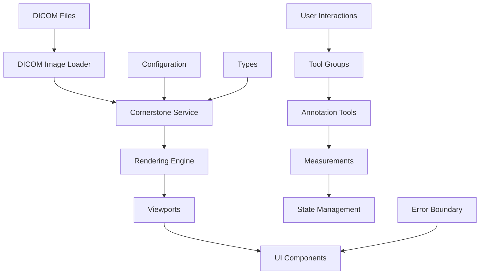

# Cornerstone3D DICOM Viewer - Architecture Documentation

## Overview

This medical imaging application is built using **Cornerstone3D v3.x** with React 18+ and TypeScript 5+. The architecture follows modern React patterns and is specifically designed for medical-grade applications with strict security and reliability requirements.

## Architecture Principles

1. **Security First**: HIPAA-compliant design with strict input validation and sanitization
2. **Type Safety**: Full TypeScript coverage with strict mode enabled
3. **Documentation-Driven Development**: Integrated with Context7 for real-time API documentation
4. **Medical-Grade Quality**: Comprehensive error handling and audit logging
5. **Performance Optimized**: Efficient rendering and memory management for large medical datasets

## Project Structure

```
src/
├── components/          # Reusable UI components
│   ├── ErrorBoundary/   # Error handling components
│   └── ...
├── config/              # Application configuration
│   └── cornerstone.ts   # Cornerstone3D settings
├── hooks/               # Custom React hooks
├── lib/                 # Utility libraries
│   └── context7Integration.ts  # Documentation integration
├── services/            # Business logic and API layers
│   └── cornerstoneService.ts   # Cornerstone3D service layer
├── store/               # State management
├── types/               # TypeScript type definitions
│   ├── dicom.ts         # DICOM-specific types
│   └── index.ts         # Centralized type exports
├── utils/               # Utility functions
├── App.tsx              # Main application component
└── main.tsx             # Application entry point
```

## Key Components

### 1. Cornerstone Service Layer (`src/services/cornerstoneService.ts`)

Provides a high-level API for Cornerstone3D operations:

- **Rendering Engine Management**: Initialize and manage rendering engines
- **Viewport Configuration**: Set up different viewport types (Stack, Orthographic, Volume)
- **Volume Handling**: Create and cache 3D volumes
- **Tool Management**: Configure annotation and measurement tools

**Key Features:**
- Singleton pattern for application-wide access
- Type-safe wrapper around Cornerstone3D APIs
- Error handling and validation
- Context7 documentation integration

### 2. Type System (`src/types/`)

Comprehensive TypeScript definitions for:

- **DICOM Data Structures**: Studies, Series, Instances, Metadata
- **Viewport Configurations**: Display settings, orientations, tools
- **Annotation Data**: Measurements, ROIs, segmentations
- **Application State**: User sessions, preferences, security context

### 3. Configuration Management (`src/config/`)

Centralized configuration for:

- **Cornerstone3D Settings**: Rendering engine, DICOM loader, tools
- **Security Policies**: HIPAA compliance, data protection
- **Performance Tuning**: Caching, WebGL settings, memory limits
- **Environment-Specific Settings**: Development vs. production

### 4. Context7 Integration (`src/lib/context7Integration.ts`)

Real-time documentation access:

- **Library Reference**: `/cornerstonejs/cornerstone3d` (443 code examples)
- **Pattern Matching**: Common code patterns and usage examples
- **Error Documentation**: Context-aware help for common issues
- **Query Generation**: Automatic Context7 queries for specific functionality

## Data Flow



## Security Architecture

### HIPAA Compliance Features

1. **Data Encryption**: End-to-end encryption for DICOM data
2. **Access Control**: Role-based permissions and audit logging
3. **Input Validation**: Strict sanitization of all user inputs
4. **Secure Headers**: CSP, HSTS, and other security headers
5. **Memory Protection**: Secure cleanup of sensitive data

### Code Quality Measures

1. **TypeScript Strict Mode**: Full type safety enforcement
2. **ESLint Security Rules**: Automated security vulnerability detection
3. **Pre-commit Hooks**: Code quality validation before commits
4. **Error Boundaries**: Graceful error handling in medical context
5. **Audit Logging**: Comprehensive logging for compliance

## Performance Optimization

### Medical Imaging Optimizations

1. **Web Workers**: Multi-threaded DICOM image processing
2. **GPU Acceleration**: WebGL-based rendering for large datasets
3. **Progressive Loading**: Staged loading for better user experience
4. **Memory Management**: Efficient caching and cleanup strategies
5. **Viewport Optimization**: Lazy loading and viewport recycling

### Caching Strategy

- **Image Cache**: Intelligent caching of frequently accessed images
- **Volume Cache**: 3D volume data caching with memory limits
- **Metadata Cache**: Fast access to DICOM metadata
- **Tool State Cache**: Persistent tool configurations

## Development Workflow

### Context7 Integration Workflow

1. **Documentation First**: Check Context7 for implementation patterns
2. **Pattern Matching**: Use documented code examples as templates
3. **Type Safety**: Implement with full TypeScript coverage
4. **Error Handling**: Include medical-grade error handling
5. **Testing**: Validate against medical imaging requirements

### Code Quality Process

1. **Pre-commit Validation**: ESLint, Prettier, TypeScript checks
2. **Security Scanning**: Automated vulnerability detection
3. **Medical Compliance**: HIPAA and medical device regulations
4. **Performance Testing**: Large dataset handling validation
5. **Error Scenario Testing**: Comprehensive error condition testing

## Integration Points

### External Services

- **WADO-RS Servers**: DICOM image retrieval
- **PACS Systems**: Picture Archiving and Communication Systems
- **Authentication Providers**: SSO and identity management
- **Audit Systems**: Compliance and usage tracking
- **Cloud Storage**: Secure DICOM data storage

### Browser Compatibility

- **WebGL Support**: Hardware-accelerated rendering
- **Web Workers**: Multi-threaded processing
- **Modern JavaScript**: ES2020+ features
- **Progressive Enhancement**: Graceful degradation for older browsers

## Deployment Architecture

### Development Environment

- **Vite Dev Server**: Fast development with HMR
- **Context7 Integration**: Real-time documentation access
- **Security Headers**: Development-friendly CSP policies
- **Mock Data**: Sample DICOM datasets for testing

### Production Environment

- **Static Asset Optimization**: Minified and compressed bundles
- **Security Hardening**: Strict CSP, HSTS, and security headers
- **Performance Monitoring**: Real-time performance metrics
- **Error Reporting**: Centralized error tracking and alerting
- **Compliance Logging**: Audit trails for regulatory compliance

## Future Roadmap

### Planned Enhancements

1. **WebGPU Support**: Next-generation GPU acceleration
2. **Machine Learning Integration**: AI-powered image analysis
3. **Multi-user Collaboration**: Real-time collaborative viewing
4. **Mobile Optimization**: Touch-friendly medical imaging
5. **Cloud Integration**: Seamless cloud PACS connectivity

### Technology Evolution

- **Cornerstone3D Updates**: Stay current with latest releases
- **Context7 Expansion**: Enhanced documentation integration
- **Security Standards**: Evolving medical device regulations
- **Performance Improvements**: Continued optimization for large datasets